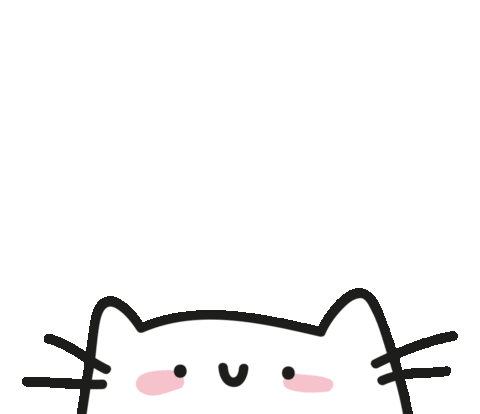
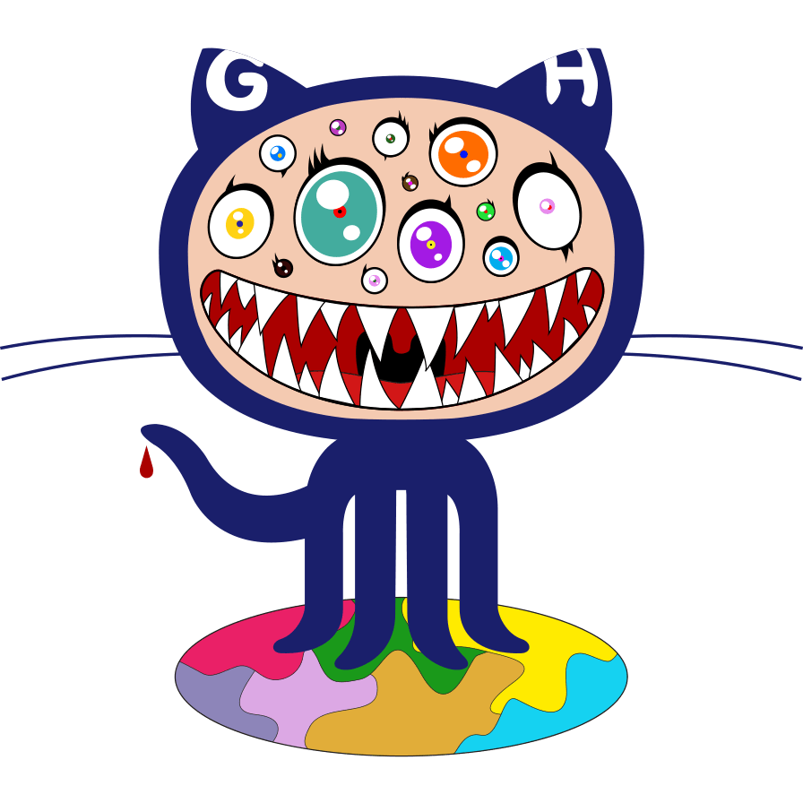

<h2 align="left">
  Hola Traaa!
  
</h2>

<!-- Banner -->

  

I am Sopheaktra Leng, a full-stack web developer who enjoys building practical and user-friendly web apps.

- 🔭 I’m working on full-stack projects using React, Next.js, Node.js, Express, MongoDB, and MySQL.
- 🌱 I’m currently learning scalable backend architecture, DevOps workflows, and production-ready app design.
- 🛠️ I have hands-on experience with authentication, API design, Docker, Kubernetes, Jenkins, and Cloudflare Workers.
- 📫 Reach me at: https://www.sopheaktraleng.app/
- ⚡ Fun fact: I love turning real problems into simple, clean software.

<!-- Tech Stack -->

<h2 align="left">Languages and Tools:</h2>

  

<!-- Social Links -->
<i><h3 align="right">Connect with me</h3></i>

  
  
  

  

